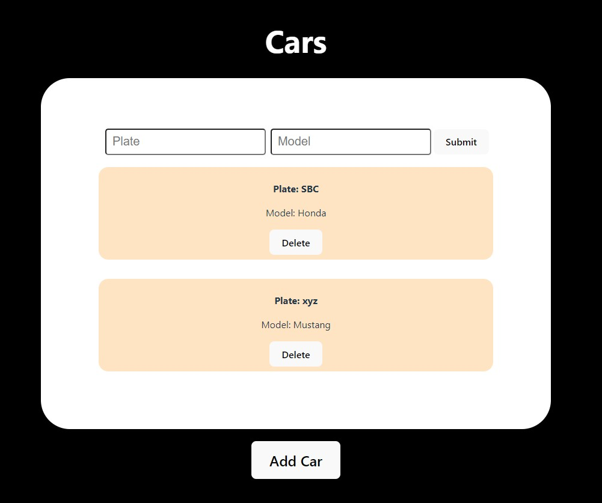

<h1> Return type error. Expected "cool_description" got "lame_programming_joke" instead. </h1>

🤓 CS major with 3.97 GPA.  

😉 Definitely studying for the next programming competition.

🤯 List of languages and frameworks I know fairly well until now (Used them in a project):

<ul>
  <li> Python </li>
  <li> C++ </li>
  <li> C </li>
  <li> HTML / CSS  </li>
  <li> JavaScript / TypeScript </li>
  <li> ReactJS </li>
  <li> Flutter </li>
  <li> PHP </li>
  <li> Laravel </li>
  <li> SQL (Oracle & MySQL) </li>
  <li> Java / Javafx </li>
  <li> I don't remember them all tbh </li>
</ul>

## Some projects I'm working on

 

Screenshot of the SE project's main page [^1].

[^1]: A very alpha build of what I'm hoping to be a fully functional [website](seproject123.netlify.app) that handles car services.

