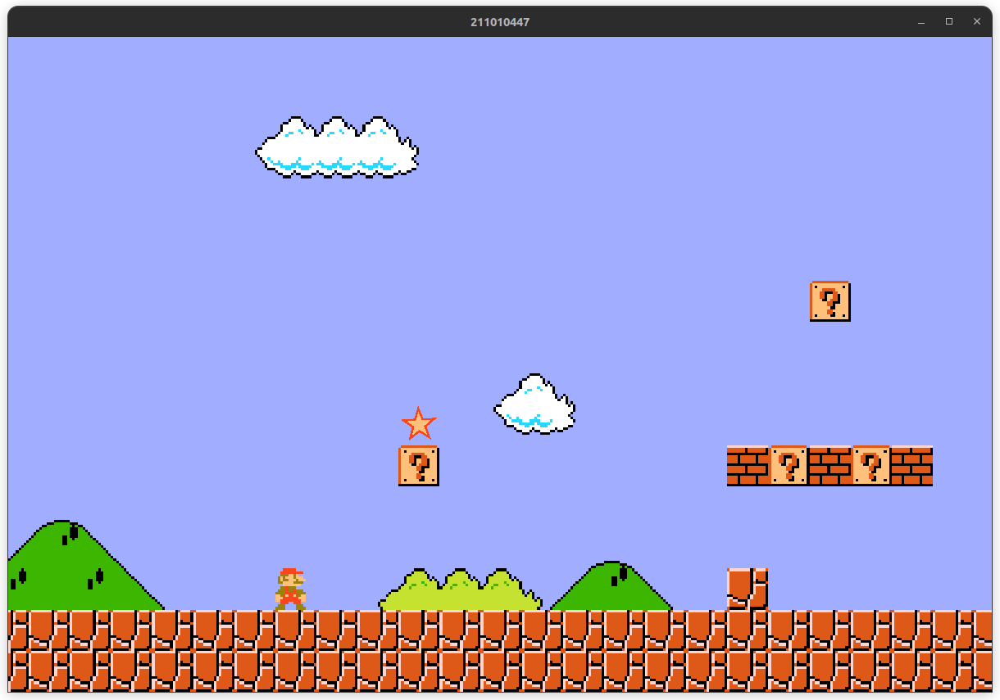

<h1> No more coding jokes - Danny. </h1>

🤓 CS major with 3.98 GPA.  

😉 Definitely studying for the next programming competition.

🤯 List of languages and frameworks I know fairly well until now (Used them in a project):

<ul>
  <li> Python </li>
  <li> C++ </li>
  <li> C </li>
  <li> HTML / CSS  </li>
  <li> JavaScript / TypeScript </li>
  <li> ReactJS </li>
  <li> Flutter </li>
  <li> PHP </li>
  <li> Laravel </li>
  <li> SQL (Oracle & MySQL) </li>
  <li> Java / Javafx </li>
  <li> I don't remember them all tbh </li>
</ul>

## ECPC 2023
(I'm the guy on the right)
 

  

## Some projects I'm working on

 

OpenGL game in c++ .

